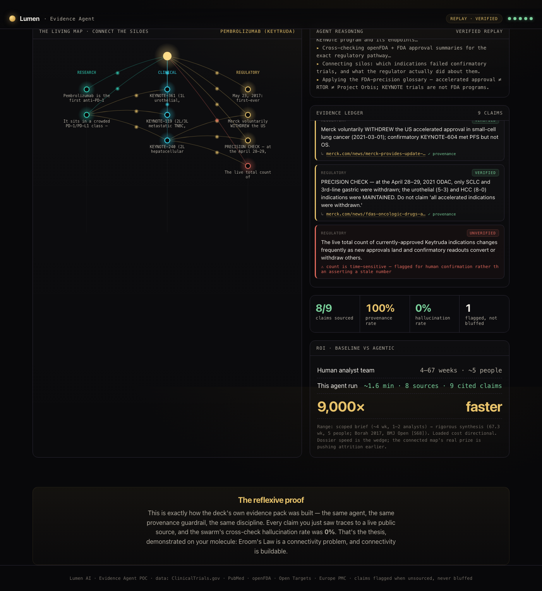

# Lumen Evidence Agent

An AI agent that assembles a **connected, cited evidence dossier** for a drug target or molecule — spanning research → clinical → regulatory — from **live public data**, with a **provenance guardrail that structurally prevents hallucinated citations**.

Type a target (say `pembrolizumab` or `trastuzumab`) and the agent queries ClinicalTrials.gov, PubMed, openFDA, Open Targets, and Europe PMC, connects the silos, and lands every claim in a governed ledger. A claim whose source no tool actually returned is auto-downgraded to **FLAGGED** — it flags what it can't source instead of bluffing.

**[▶ Live demo](#)** *(hosted static build — verified replays run in the browser, no server)*



## What makes it trustworthy

- **Provenance guardrail** (`server/ledger.js`) — a recorded claim must cite a URL that a tool actually returned this run; anything else is flagged, never shown as fact. This is the structural fix for the "confident wrong citation."
- **FDA-precision glossary** (`server/glossary.js`) — validates program names (Accelerated Approval, Breakthrough, Priority Review, RTOR, Project Orbis) and refuses to frame a trial (KEYNOTE, VERITAC) as an FDA program.
- **Verification tiers** — every claim is `VERIFIED` / `DIRECTIONAL` / `FLAGGED` / `UNVERIFIED`, mirrored in the UI.
- **Adversarial cross-check** — the showcase dossiers were built and then verified by a swarm of independent agents (3-vote), measuring a hallucination rate. See `data/golden/`.

## Run it

```bash
npm install
npm run test:tools        # smoke-test the 5 live public APIs (no keys needed)
npm run test:guardrail    # prove the anti-hallucination guardrail
npm start                 # http://127.0.0.1:8787  (replay works immediately)
```

Live "any molecule" mode needs `ANTHROPIC_API_KEY` (copy `.env.example` → `.env`). Optional `NCBI_API_KEY` / `OPENFDA_API_KEY` raise rate ceilings; the app runs keyless otherwise.

```bash
npm run build             # regenerate the self-contained static build → dist/ and docs/
```

## Data sources (all public, keyless-capable)

ClinicalTrials.gov API v2 · NCBI PubMed E-utilities · openFDA · Open Targets Platform GraphQL · Europe PMC.

## Layout

```
server/   tools.js (5 API wrappers) · agent.js (Claude tool-use loop) · ledger.js (provenance guard) · glossary.js · roi.js · index.js (Fastify+SSE)
public/   index.html · app.js (canvas "living map" + SSE client) · golden.js (generated)
data/golden/  verified showcase dossiers (JSON)
docs/     GitHub Pages static build (single self-contained file)
scripts/  test-tools · test-guardrail · build-static · bake-golden
```

MIT-licensed demo. Not medical advice; all facts trace to the cited public sources.
